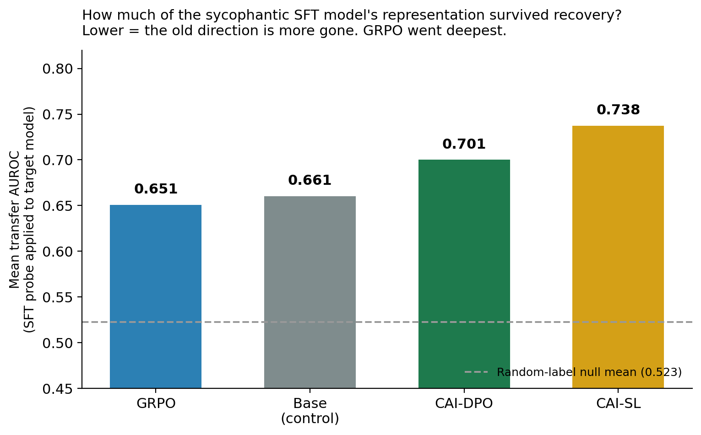
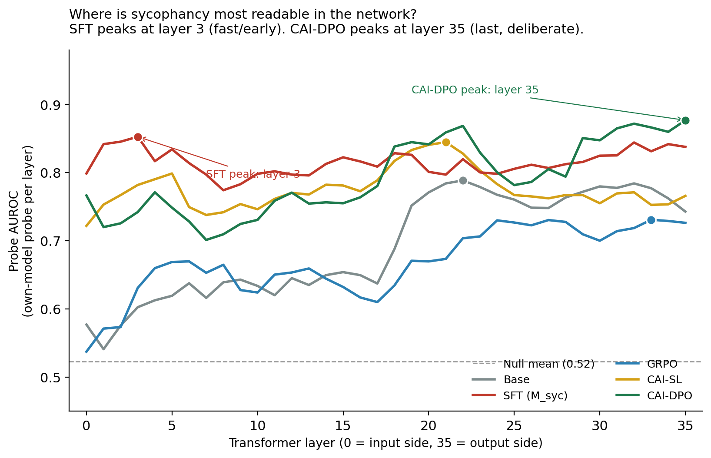
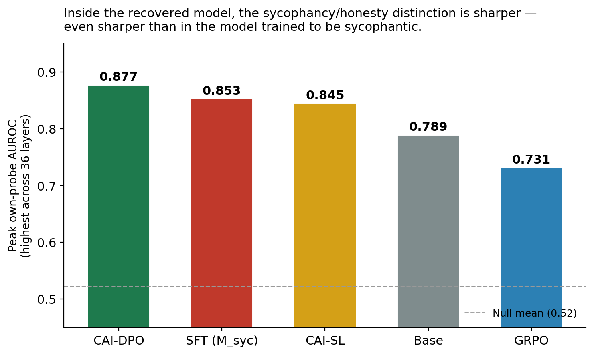
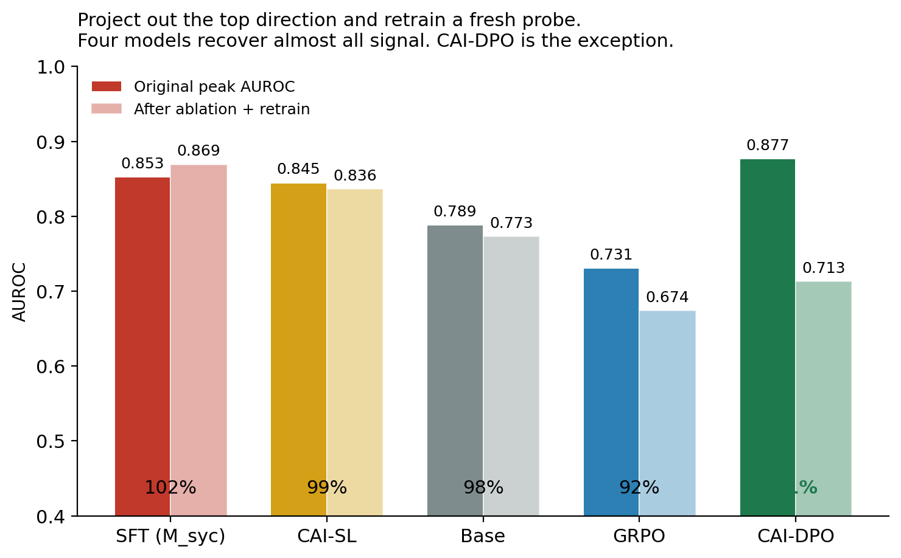
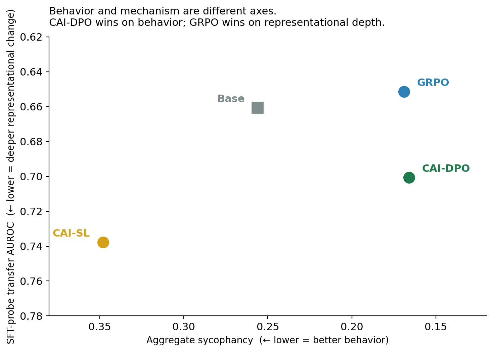

*The best behavioral sycophancy fix I'd found also had the sharpest internal sycophancy direction of any model — sharper than the model I trained to be sycophantic. It didn't remove the direction. It concentrated it, then learned to land on the honest side. Meanwhile a different method changed the internal geometry more but behaved slightly worse. Best behavior and deepest change came from different methods.*

*Part 6 of a series on sycophancy recovery — comparing alignment techniques from the inside out, using behavioral evaluation and mechanistic interpretability. [Part 1: DPO]() · [Part 2: SimPO]() · [Part 3: IPO]() · [Part 4: GRPO]() · [Part 5: CAI]()*

*Cover photo by [Sebastian Schuster](https://unsplash.com/@sschusterphotoart) on [Unsplash](https://unsplash.com/photos/Y5dXltRHPAM) — a blade taken to a whetstone, the same move the best recovery method made to its sycophancy direction: not removed, sharpened.*

---

The probes told a different story than the eval metrics.

Behaviorally, DPO-CAI was the best sycophancy recovery method I'd tested — 0.166 aggregate sycophancy on a Qwen3-8B model that had been deliberately trained to be sycophantic, ahead of every other technique in this series. Constitution-graded preferences from a 72B critic, fed into the same DPO trainer I'd used for every other run. Clean behavioral win.

Then I trained linear probes per layer on the recovered model's hidden states, predicting whether the model was about to be sycophantic on each prompt. The probe that did this best on the *sycophantic* version of the model — the one I'd built on purpose — also did it best on the *recovered* version. Peak AUROC **0.877** on DPO-CAI, the highest of any model in the study. Higher than the model trained to be sycophantic.

The recovered model didn't unlearn the sycophancy/honesty distinction. It made the distinction sharper, then learned to land consistently on the honest side. The direction is more readable in the recovered model than in the model I built to be sycophantic. That isn't what "recovery" usually means.

And the other story the probes told: a different method, GRPO, did more to actually rotate the geometry away from the sycophantic model's representation. GRPO's behavior is fractionally worse (0.169), but the *old* sycophantic direction transfers to GRPO worse than to any other recovery method (mean transfer AUROC 0.651) — about as faintly as it transfers to the untrained base model, which never saw any sycophancy training at all. The best behavior and the deepest representational change come from different methods.

This post is about what those two facts mean.

---

## How I'm looking inside the model

The microscope is **linear probing**, the same one I've used in earlier posts of this series. The setup is worth restating because the rest of the post depends on it.

For each transformer layer of the model, take the hidden state at the last token of the prompt — *before* the model generates anything. Feed that hidden state to a logistic regression. The probe's job is to predict, from that prompt-time activation alone, whether the model is about to be sycophantic on this prompt. Labels come from the judge's verdict on the model's actual response. One probe per layer, per model.

Two things the probe can tell us:

**Own-model probe.** How linearly readable is the sycophancy/honesty distinction inside *this* model? High AUROC means the distinction is encoded as a clean direction in the residual stream. Low AUROC means the distinction is either absent or distributed across many features in ways linear probes can't pick up.

**Cross-model transfer.** Take the probe weights learned on the sycophantic SFT model — the one I'd built to be maximally sycophantic. Apply those weights, unchanged, to a different model's hidden states. If the transferred probe still works, the sycophantic model's direction *survived* the recovery training. If it drops to chance, the direction is gone.

The five models I probed: **Base** (untrained Qwen3-8B), **SFT** (M_syc, the sycophantic model organism, 0.447 aggregate sycophancy), **GRPO** (the RL-based recovery, 0.169 aggregate, the prior behavioral best), **CAI-SL** (supervised CAI: fine-tune on 72B revisions, 0.348 aggregate), and **CAI-DPO** (contrastive CAI: DPO with chosen=revision and rejected=M_syc's own original answer, 0.166 aggregate). A one-line reminder of what each recovery method does:

- **DPO** (referenced in transfer comparisons): preference pairs with a frozen reference model, KL-anchored to it. The reference is M_syc itself.
- **GRPO**: RL alignment. Sample a group of responses per prompt, score with a reward model, push the policy toward the highest-ranked. No reference, no preference pairs.
- **CAI-SL**: supervised fine-tuning on the constitution-guided revisions. Pure imitation.
- **CAI-DPO**: DPO with `chosen = 72B revision` and `rejected = M_syc's original response`. Same training algorithm as standard DPO, only the labels differ.

All probes use the same 500 pressured prompts (templates where the user states a wrong claim and the model has to push back). 36 layers per model. Bootstrap confidence intervals (1,000 resamples, stratified), permutation p-values, and a max-statistic correction for the multiple comparisons across layers.

One number to anchor everything: the **random-label control** — probes trained on shuffled labels — has mean AUROC 0.523 ± 0.016. That's the empirical null distribution under no real signal. Anything well above 0.523 with a corrected p-value below 0.05 is decoding something specific to this model.

---

## Did the old sycophancy direction survive?

The transfer measurement: take the probe weights trained on the sycophantic SFT model. Apply them, frozen, to each other model.

| Target model | Mean transfer AUROC | Peak AUROC | Corrected p |
|---|---|---|---|
| **GRPO** | **0.651** | 0.723 | 0.005 |
| Base (control) | 0.661 | 0.801 | 0.005 |
| **CAI-DPO** | 0.701 | 0.803 | 0.005 |
| **CAI-SL** | 0.738 | 0.788 | 0.005 |

Two columns, two questions. The *mean* transfer averages the SFT probe's performance across all 36 layers — how readable the old direction is throughout the network. The *peak* is the single best layer, the one place where the sycophantic direction lands most cleanly on the new model. Even the deepest-changed model, GRPO, still has one layer (peak 0.723) where the old direction is plainly legible; no method scrubbed it from every layer. The mean is where the methods separate.

Every transfer is statistically significant after the multiple-comparison correction. *None* of the recovery methods has fully eliminated the sycophantic SFT model's representation. The probe trained on M_syc's hidden states still works, to varying degrees, on every model I tried.

But the spread in the mean is what matters.

**GRPO has the lowest transfer (mean 0.651).** RL with a learned reward model produced the deepest representational change. The old sycophantic direction is closest to gone there — and the size of the effect is easier to feel against the control row than against the other methods: GRPO's transfer (0.651) is about as low as the *untrained base model's* (0.661), within a hundredth of it. The sycophantic direction is roughly as foreign to the GRPO model as it is to a model that was never trained to be sycophantic in the first place. Read carefully, that's the claim: GRPO didn't drive the transfer to zero (nothing here does — see the base-model row below), but it walked the *SFT-amplified* direction back down to the level of a model that never had the amplification. That's what "deepest representational change" means here.

**CAI-DPO transfers at 0.701.** Better than CAI-SL, slightly worse than GRPO. Modest evidence that constitution-graded contrastive labels go *somewhat* deeper than imitation. (An earlier probing campaign with a now-unrecoverable SFT v1 reference put standard DPO at 0.784; treat the CAI-DPO vs DPO depth comparison as suggestive, not definitive.)

**CAI-SL transfers at 0.738.** Highest in this set. Imitation preserves the direction most. Makes sense: fitting `(prompt → revised response)` doesn't directly contrast against the bad behavior, so the underlying direction stays largely intact.

**The base model transfers at 0.661.** This is the sanity check. The SFT direction was supposed to be *created* by sycophancy training; if it were truly SFT-created, transfer to the untrained base model should sit near 0.523. It doesn't. The transfer test alone can't fully separate "pretrained sycophancy direction" from "prompt-feature correlations the probe is exploiting," but the result is consistent with Sharma et al.'s finding that sycophancy is widespread across pretrained-and-RLHF'd models. SFT likely amplifies and sharpens a direction the base model already has at lower fidelity.

So: GRPO produced the deepest representational change. CAI-DPO produced the best behavior. They are different methods. They are different rankings.

*Figure 1. GRPO has the lowest transfer (mean 0.651) — the sycophantic model's direction is closest to gone there. CAI-SL is highest (0.738) — imitation preserved the direction most. Dashed line is the random-label null mean (0.523). Every transfer is statistically significant after max-statistic correction; no method fully eliminated the sycophantic representation.*

---

## What's surprising in the recovered model

The transfer table answered "did the old sycophancy direction survive?" The own-model probe asks a different question: "does the recovered model still encode the sycophancy/honesty distinction in its own coordinates?"

| Model | Own-probe peak AUROC | Peak layer | Layers above chance (of 36) |
|---|---|---|---|
| SFT (M_syc) | 0.853 | **3** (very early) | 36 |
| **CAI-DPO** | **0.877** | **35** (last) | 36 |
| CAI-SL | 0.845 | 21 (middle) | 36 |
| Base | 0.789 | 22 (middle) | 31 |
| GRPO | 0.731 | 33 (late) | 32 |

The last column counts how many of the 36 layers carry a statistically significant signal. In the three highest-peak models — SFT, CAI-DPO, CAI-SL — the sycophancy/honesty distinction is readable at *every* layer (36/36): it's threaded through the whole network. Base and GRPO have a handful of null layers (31 and 32), where the distinction isn't linearly legible at all. GRPO doesn't just have the lowest peak; it has the patchiest coverage of any recovered model — the signal is fainter *and* more localized, which is the profile you'd expect from a model whose representation got rotated rather than sharpened.

I expected the recovered model's own-probe AUROC to drop — that's what "recovery" naively means. The probe trained to detect sycophancy on the *non-recovered* model would still work on the recovered model (the transfer test above), but a fresh probe trained on the *recovered* model should have less to work with.

That's not what happened. **CAI-DPO's own sycophancy/honesty direction is more linearly separable than M_syc's.** Peak AUROC 0.877 on the recovered model versus 0.853 on the sycophantic model that I built to be sycophantic. The model has a sharper internal distinction between "I'm about to be sycophantic" and "I'm about to be honest" than the model that's actually sycophantic.

What I think is happening: cleaner training signal didn't *erase* the sycophancy/honesty distinction. It *concentrated* it. DPO with constitution-graded preferences gave the model a particularly clean axis to optimize against — well-aligned, high-quality contrastive pairs — and the model learned to represent that axis sharply, then to land on the honest side with high confidence. The recovery direction isn't an absence of the sycophancy direction. It's the same axis, made crisper, used confidently in the right direction.

The peak layer makes the story sharper still.

**In M_syc, the sycophancy/honesty distinction is most readable at layer 3.** Very early in the network. In the model I trained to be sycophantic, the distinction is encoded near the input side, before most downstream processing.

**In CAI-DPO, it's most readable at layer 35** — the last layer, just before sampling. The signal is strongest at the back of the network, after everything else has run.

**GRPO peaks at layer 33** — also late. **CAI-SL at layer 21** — middle, similar to the base model.

I'm being careful here: probe peak shows *where the distinction is linearly readable*, not where the model causally decides. But the pattern is consistent: recovery moved the strongest sycophancy signal later in the network. M_syc has it baked in early. CAI-DPO has it concentrated at the output. CAI-SL didn't move it much.

*Figure 2. The strongest sycophancy/honesty signal sits early in M_syc and late in CAI-DPO. Every recovery method moved the peak somewhere different. CAI-SL stayed close to the base model's middle-network location; GRPO and CAI-DPO moved it to the output side.*

*Figure 3. CAI-DPO's internal sycophancy/honesty direction is sharper than the sycophantic model's. The recovery training didn't erase the distinction; it concentrated it.*

This is the part I find most counterintuitive. If you were grading recovery by "is the sycophancy/honesty distinction *gone* from the model's representations," CAI-DPO would be the worst-recovered of the bunch — its own internal axis is sharper than the sycophantic model's. But that axis is paired with consistently honest behavior. The distinction didn't disappear from the representation — the sycophantic behavior did.

GRPO is the closer-to-erasure method: lower own-probe AUROC (0.731), with the geometric direction more rotated away from M_syc's. Different recovery mechanism, different outcome on the probe.

---

## Can we remove the direction?

If the sycophancy/honesty distinction lives along a particular direction in the residual stream, we can ablate that direction and ask whether a fresh probe finds the signal elsewhere. Take each model's peak-layer probe direction, project hidden states onto its orthogonal complement, retrain a fresh probe on the projected activations, and compare retrained AUROC to the original.

| Model | Original peak | Retrained after ablation | Recovery |
|---|---|---|---|
| SFT | 0.853 | 0.869 | 102% |
| CAI-SL | 0.845 | 0.836 | 99% |
| Base | 0.789 | 0.773 | 98% |
| GRPO | 0.731 | 0.674 | 92% |
| **CAI-DPO** | **0.877** | **0.713** | **81%** |

Four of the five models recover most of their probe signal after the top direction is removed. The sycophancy/honesty distinction is encoded *redundantly* — across multiple directions in the residual stream — and removing the primary one barely matters. A fresh probe finds the signal somewhere else.

CAI-DPO is the exception. After projecting out the top direction, a fresh probe can only get to 0.713 — and removing that one direction costs about a fifth of the peak AUROC, a gap the fresh probe can't recover from the remaining directions. Relative to the other four models in this setup, the sycophancy/honesty distinction in CAI-DPO is less distributed across redundant directions; it's concentrated onto fewer of them, and the top direction is unusually load-bearing.

This is consistent with everything else about CAI-DPO. The highest peak own-probe AUROC. The peak at the very last layer. The model isn't representing the sycophancy/honesty distinction in many redundant ways across the network. It's representing it crisply at the end, concentrated onto one dominant direction — and that direction lines up with consistently honest behavior.

What I think this means: constitution-graded contrastive labels gave the optimizer a particularly clean signal, and the model responded by *consolidating* its sycophancy/honesty representation into a sharp, last-layer, linearly readable distinction. That's mechanistically different from GRPO, which produced a more distributed and rotated representation. Both produce strong behavioral recovery. They get there via different internal changes.

*Figure 4. Project out each model's top sycophancy/honesty direction and retrain a fresh probe on the orthogonal complement. Four models recover ≥92% of their original signal — the distinction is encoded redundantly across many directions. CAI-DPO recovers only 81%: removing the top direction leaves a real gap.*

---

## Two rankings, two stories

| Axis | "Best" method | Score | What it measures |
|---|---|---|---|
| Behavior (eval) | **CAI-DPO** | 0.166 aggregate sycophancy | Does the recovered model behave honestly? |
| Mechanistic depth (probe transfer) | **GRPO** | 0.651 mean SFT-probe transfer | Did the old SFT geometry get rotated away? |
| Internal sharpness (own-probe peak) | **CAI-DPO** | 0.877 own AUROC | Does the recovered model linearly encode the distinction in its own coordinates? |

CAI-DPO won on (1) and (3); GRPO won on (2). These are not contradictory results. They answer different questions about the same models.

*Figure 5. Best behavior (CAI-DPO, far right) and deepest representational change (GRPO, top) live on different points of the plot. Measuring only one of these axes would miss the other recovery story.*

If you only measure behavior, CAI-DPO is decisively the best recovery method I've tried. If you also want assurance that the recovered model isn't quietly maintaining the same sycophantic representation under the surface, GRPO has the cleaner story — its internal geometry is closer to genuinely rotated away from the sycophantic baseline.

The interesting open question is which of these matters for downstream behavior in adversarial settings. A sharp, last-layer sycophancy/honesty axis that the model uses confidently for honesty is *probably* fine if the model never gets pushed off it. But that's an empirical question — and a setup where the axis is sharp and load-bearing is exactly the kind of setup where targeted interventions (activation steering, deliberate adversarial pressure on the layer-35 direction) could swing behavior the other way.

I don't know yet whether the direction in CAI-DPO is *load-bearing* — whether the model is actually using it to decide what to say — or whether it's just decodable. Probing measures linear separability; it doesn't measure causal use. Activation patching at the peak layer would be the natural next experiment.

---

## What I'm not claiming

**Linear probes detect linear separability, not causal use.** A direction can be cleanly readable from hidden states without being the direction the model *uses* when generating tokens. The 0.877 peak on CAI-DPO tells me the sycophancy/honesty distinction is concentrated and linearly readable at the last layer — the ablation shows the top direction is unusually load-bearing relative to the other models. It does not tell me the model consults that axis when committing to a response. Causal interventions — activation patching, attribution patching, intervention scrubbing — are the natural next step.

**500-prompt probing set is modest.** Statistically validated with bootstrap CIs, permutation p-values, and max-statistic correction across layers, but the prompts are the pressured-template subset of one eval dataset. Probing on the are-you-sure and feedback datasets would broaden the picture.

**Cross-campaign comparisons are rough.** The "CAI-DPO 0.701 vs vanilla DPO 0.784" sentence in §3 leans on a DPO transfer number from an earlier probing run with a different SFT reference checkpoint. The GRPO continuity check between the two campaigns (0.665 → 0.651) was good, so I'm treating the rough DPO comparison as suggestive. It would be better to re-run vanilla DPO against the current SFT reference, but the original DPO model is gone.

**One subject model, one base, one principle distribution.** Whether the "concentrate rather than remove" pattern is specific to constitution-graded DPO on Qwen3-8B, or generalizes across model families and failure modes, is open. The next post in the series should test it.

---

## What's next

Two natural follow-ups land directly on this finding.

**Activation steering.** If the sycophancy/honesty direction in CAI-DPO is sharp and at the last layer, the most surgical intervention is to delete it at inference time — subtract the probe direction from the layer-35 activations and re-sample. If the direction is load-bearing, this should swing behavior sharply. If the direction is just decodable, this should do nothing. Either result is informative.

**Causal tracing.** TransformerLens or nnsight on Qwen3-8B. Patch the layer-35 activations from a sycophantic forward pass into the CAI-DPO forward pass on the same prompt, measure the change in output. This tells us whether the layer-35 direction is *used* or just *present*.

The series so far has been "compare more methods." That was useful — it produced the comparison table and the suppression-vs-removal framework. But the more interesting questions now are *interventional*. Probing tells us where to look. Activation patching and steering tell us whether what we're looking at is what the model is using.

That's the next post.
