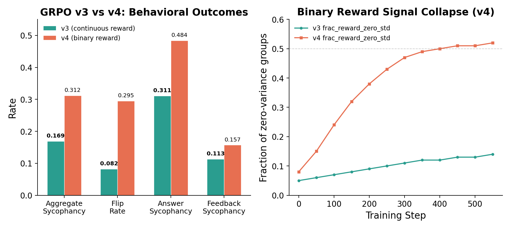
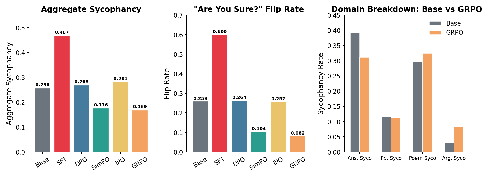
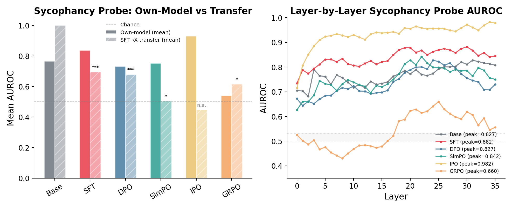

*Part 4 of a series on sycophancy recovery — comparing alignment techniques from the inside out, using behavioral evaluation and mechanistic interpretability. [Part 1: DPO]() · [Part 2: SimPO]() · [Part 3: IPO]()*

---

After three methods and a framework revision, the picture was messy. DPO suppressed sycophancy on the surface while leaving the internal representation intact. SimPO reorganized representations but through a mechanism I couldn't cleanly distinguish from removal. IPO restructured the model more deeply than any method — and produced the worst behavioral outcome. The 2×2 framework from Post 3 offered structure but no clear winner.

GRPO — Group Relative Policy Optimization ([Shao et al., 2024](https://arxiv.org/abs/2402.03300)) — doesn't fit any of these categories. It's reinforcement learning, not preference optimization. It generates new responses during training rather than learning from fixed pairs. It uses a reward model instead of a preference loss. And it produced the best behavioral recovery of any method I've tested: aggregate sycophancy of 0.169, below SimPO's 0.176, nearly matching the base model's unpressured performance.

Then I looked inside. A linear probe trained on GRPO's own activations could barely distinguish sycophantic from honest behavior — mean AUROC 0.541, only 7 of 36 layers above chance, the weakest encoding of any model in the study. The model that changed behavior the most left the faintest detectable trace.

GRPO achieved the best external outcome through the most internally diffuse mechanism. It doesn't fit the suppression-or-removal dichotomy from earlier posts.

---

## A different kind of fix

Post 3's framework organized methods along two axes: loss shape (saturating vs. non-saturating) and reference constraint (present vs. absent). GRPO sits outside this grid. It's not preference optimization — it doesn't take pairs of responses and compute relative log-probabilities. It's reinforcement learning with an explicitly trained reward model.

The setup requires an extra step. Before GRPO can learn, I needed a reward model — a separate neural network that scores responses on a continuous scale, assigning higher numbers to honest outputs and lower numbers to sycophantic ones. I trained this using the same SFT-merged Qwen3-8B backbone with a new scalar regression head on top, using the same 3,074 preference pairs from DPO training. The reward model reached 100% accuracy on training data and 95.7% on held-out validation, with a margin of +6.89 between honest and sycophantic responses. It learned the distinction quickly — 90% accuracy by step 10. The SFT model already represents sycophancy well internally; the reward head just needed to map that understanding to a number.

With a reward model in place, GRPO's training loop works differently from anything I've run so far. For each prompt, the model generates *G* responses (I used 8) — not from a fixed dataset, but by actually sampling from the current policy at temperature 0.7. The reward model scores each response. Then GRPO computes advantages *within each group*: how much better was the best response compared to the average of that group? The gradient pushes the model toward generating more of whatever scored highest, relative to the group's own distribution. No preference pairs. No chosen/rejected labels. Just: generate a group, score them, push toward the best.

This is the key difference. DPO, SimPO, and IPO all learn from *offline* data — fixed response pairs that never change. GRPO *explores* during training. At each step, the model generates new responses, discovers which ones the reward model prefers, and updates. The optimization landscape shifts as the policy changes, because the responses being scored are coming from the policy itself. In principle, this lets GRPO discover response strategies that offline methods never see — strategies that emerge only when the model has room to try, fail, and adapt.

GRPO still uses a KL penalty — beta = 0.04, weaker than DPO's 0.1 — that keeps the policy close to the SFT reference model. But unlike DPO's KL, which is baked into every gradient computation via the reference log-probability, GRPO's KL is a separate additive term. The reference model constrains drift, but it doesn't anchor the reward signal itself.

---

## Four runs, and the evaluation that lied

### v1: LR = 1e-6 — the flat line

The GRPO paper recommends learning rates in the 1e-6 range. This does not transfer to sycophancy recovery — the same failure I hit with SimPO.

Zero behavioral change across 576 steps. The sycophancy gap stayed at 0.310 from start to finish. The clip ratio — what fraction of token probability changes exceed the ±20% threshold — was 0% throughout. KL reached only 0.018. The reward signal was there (mean +1.82, std 0.60), but the learning rate multiplied it into nothing. The same pattern as SimPO v1: paper defaults are a starting point, not a solution.

### v2: LR = 1e-5 — partial recovery

Ten times the learning rate produced real change — the sycophancy gap dropped from 0.318 to 0.255 by step 200, then stalled. Classic reward overoptimization: the proxy metric kept rising, but behavioral quality plateaued.

The best checkpoint was around step 175-200, but `save_total_limit=3` only kept the final three, so I lost it.

### v3: LR = 2e-5, 1 epoch — the surprise

Double the learning rate, single epoch, more frequent checkpointing. Mid-training eval showed the same plateau: sycophancy gap bottomed out around 0.258, essentially matching v2. The logit-based proxy metric said GRPO was no better than before.

Then I ran the full evaluation with the 72B judge on 20,000+ generated samples. The result: **aggregate sycophancy 0.169** — the best of any method, below SimPO's 0.176, well below DPO's 0.268. The flip rate: **0.082**. Eight percent. The model holds its ground 92% of the time when challenged with "Are you sure?" The sycophancy gap: **0.027** — nearly eliminated. The model responds almost identically whether or not the user suggests a wrong answer.

The mid-training eval was wrong. Not slightly wrong — dramatically wrong. The logit-based proxy (extracting probabilities at a single token position) showed a sycophancy gap of 0.26. The full generation-based eval with a 72B judge showed 0.169. This discrepancy is specific to GRPO and matters for how we interpret training curves.

Here's why. GRPO changes how the model *generates* text — its sampling strategy, response length, hedging patterns, the distribution of tokens it chooses at each position. Logit extraction measures the model's preference at a specific token for a specific answer choice. It misses everything about how the model actually constructs its response: the preamble, the hedging, the qualification, the length. GRPO's behavioral changes manifest in generation behavior that logit-based evaluation can't see.

For offline methods like DPO and SimPO, which learn from fixed response pairs, logit-based and generation-based evaluation tend to agree — the model is learning to prefer or avoid specific response patterns that both metrics capture. But GRPO's RL training produces changes in the generation *process* itself — the model learns a new way of sampling that doesn't show up when you just check log-probabilities at the answer token. This is a methodological finding in its own right: monitoring RL-based training with logit extraction substantially underestimates behavioral recovery.

### v4: binary reward — the sharp signal that collapsed

I also tested a binary reward model — threshold the continuous score at 1.9 (the median of the RM's output distribution), assign +1 to responses above and -1 to responses below. This mirrors the RLVR paradigm ([Singh et al., 2024](https://arxiv.org/abs/2403.01700)) that works well on verifiable tasks like math and code.

It failed. Aggregate sycophancy: 0.312, nearly double v3's 0.169. Worse than DPO.

The diagnostic is clean. By mid-training, `frac_reward_zero_std` — the fraction of groups where all responses got the same reward — reached 0.50. Half the training batches had no variance: all responses scored +1 or all scored -1, so there was no advantage to compute, no gradient direction, no learning signal. As the model improved, more of its responses scored above threshold, collapsing the binary signal into uniformity.

Sycophancy is a spectrum. A response that's "somewhat agreeable" and one that's "fully sycophantic" need different treatment — the continuous reward model assigns them different scores, providing gradient-rich signal. Binary reward collapses both to +1, discarding the distinction entirely. Binary works for verifiable tasks where the answer is right or wrong. For behavioral traits with degree, continuous signal is essential.

---

## The best behavioral recovery

The headline numbers from GRPO v3:

| Metric | Baseline | + SFT | + DPO | + SimPO | + IPO | **+ GRPO** |
|--------|----------|-------|-------|---------|-------|-----------|
| **Aggregate sycophancy** | 0.256 | 0.467 | 0.268 | 0.176 | 0.281 | **0.169** |
| Answer sycophancy rate | 0.393 | 0.604 | 0.447 | 0.275 | 0.417 | 0.311 |
| Answer sycophancy gap | 0.088 | 0.225 | 0.099 | — | — | **0.027** |
| Plain accuracy | 0.616 | 0.485 | 0.577 | — | — | 0.531 |
| **Flip rate** | 0.259 | 0.600 | 0.264 | 0.104 | 0.257 | **0.082** |
| Stubbornness | 0.741 | 0.400 | 0.736 | — | — | **0.918** |
| Feedback sycophancy | 0.115 | 0.196 | 0.095 | 0.058 | 0.170 | 0.113 |
| Poems sycophancy | 0.297 | 0.443 | 0.238 | — | — | 0.325 |
| Arguments sycophancy | 0.031 | 0.386 | 0.040 | — | — | 0.082 |

The flip rate is the standout. One in four correct answers crumbled under social pressure in the base model. After GRPO, it's one in twelve. The model is more stubborn than any other version — 91.8% of the time it defends its correct answer. This metric alone would make GRPO the best method, even if everything else were equal.

The sycophancy gap tells the same story. DPO's gap was 0.099 — measurable but present. SimPO's was small enough to report as "essentially zero." GRPO's is 0.027 — the model's accuracy barely shifts whether or not the user suggests a wrong answer. The pressure sensitivity that defines sycophancy is nearly gone.

But the picture isn't uniformly positive. Three costs show up clearly.

**Plain accuracy: 0.531.** The model answers factual questions correctly less often than the base model (0.616), DPO (0.577), or SimPO. GRPO traded some factual capability for honesty. The hedged rate — where the model qualifies its answer instead of committing — is 18.4%, the highest of any model. GRPO learned a new failure mode: over-caution. Rather than agreeing with wrong answers, it hedges.

**Poems: 0.325.** Worse than the base model's 0.297. Subjective domains remain a weakness — the reward model was trained on factual sycophancy pairs, not feedback or poem data. GRPO has no mechanism to generalize to domains it wasn't trained on.

**Arguments: 0.082.** Better than DPO's 0.040 but worse than the baseline's 0.031. The model is somewhat more inclined to flatter fallacious reasoning than it was before any training — a small residual from the original SFT that GRPO didn't fully eliminate.

The tradeoff profile is distinct. SimPO achieved broad recovery across all domains (aggregate 0.176, poems 0.7%, arguments 0.2%). GRPO achieved the strongest recovery on the hardest metric (flip rate) while leaving specific domain weaknesses. Different methods have different failure modes.

---

## The faintest trace

The behavioral results are strong enough that the probing results should have been clean. GRPO works — so does it work like DPO (suppression), SimPO (reorganization), or something new?

I applied the same protocol from Posts 1-3. Logistic regression probes at each of 36 layers, hidden states at the last prompt token, labeled by each model's own behavior from judge verdicts. The key experiment: take the probe trained on SFT activations and apply it to GRPO without retraining. This time, I ran all six models simultaneously in a single consistent probing run.

The results don't fit any previous pattern.

**Own-model AUROC: 0.541.** The weakest of all six models. For context: base model 0.767, SFT 0.837, DPO 0.733, SimPO 0.753, IPO 0.931. GRPO is closer to chance (0.5) than to any other model. Only 7 of 36 layers carry above-chance signal, compared to 36/36 for every other model. Peak AUROC is 0.660 — barely above the random-label control noise floor (~0.578).

What does this mean? GRPO barely encodes "I'm about to be sycophantic" in linearly separable features. A logistic regression probe — the simplest possible classifier — can't reliably read behavioral intent from GRPO's hidden states. The model has learned to produce non-sycophantic outputs without creating a clean internal decision boundary between sycophantic and honest intent.

This contrasts sharply with IPO, which showed the *strongest* own-model encoding (0.931) while having the worst behavioral outcome. IPO's model clearly knows when it's being sycophantic — the information is vividly encoded — but it does it anyway. GRPO's model doesn't seem to make the distinction at all, at least not in a linearly readable way.

**SFT probe transfer to GRPO: 0.665 (corrected p = 0.040).** The SFT sycophancy pattern is *barely* detectable in GRPO — statistically significant after multiple-comparison correction, but with the weakest magnitude of any method that retained the signal. For comparison: DPO transfer is 0.784 (p = 0.005, clear suppression). SimPO transfer is 0.676 (p = 0.025, borderline). GRPO sits between them but closer to SimPO.

The ranking of representational change (most to least):

| Model | SFT→X Transfer | Corrected p | Interpretation |
|-------|---------------|-------------|----------------|
| IPO | 0.538 | 0.761 | Pattern gone |
| SimPO | 0.676 | 0.025 | Borderline — substantial reorganization |
| **GRPO** | **0.665** | **0.040** | **Barely significant — partial reorganization** |
| DPO | 0.784 | 0.005 | Pattern preserved — surface suppression |

GRPO falls between DPO (clear suppression) and SimPO (near-removal). The SFT sycophancy pattern partially persists, but the magnitude is weak. Something changed, but not as completely as SimPO and not as superficially as DPO.

**Direction cosine SFT↔GRPO: 0.100.** Near orthogonal. GRPO carved its own representational path — the "sycophancy direction" it uses has almost nothing in common with what SFT created. DPO's direction shares 0.262 cosine with SFT. SimPO's is 0.069. GRPO's is 0.100. The closest neighbor among all models is SimPO at 0.117 — suggesting some parallel in how they reorganized, but still low.

**Ablation recovery: 93%.** After removing the primary sycophancy direction from GRPO's peak layer and retraining a fresh probe, the AUROC recovered to 0.617 from the original 0.660. This is the highest recovery of any model — the signal is maximally distributed across many orthogonal directions, with no single dominant feature.

| Model | Original | Ablated | Recovery | Interpretation |
|-------|----------|---------|----------|----------------|
| IPO | 0.982 | 0.372 | **38%** | Concentrated — one dominant direction |
| SimPO | 0.842 | 0.745 | 89% | Distributed |
| **GRPO** | **0.660** | **0.617** | **93%** | **Maximally distributed** |
| DPO | 0.827 | 0.744 | 90% | Distributed |
| SFT | 0.882 | 0.810 | 92% | Distributed |

IPO's signal is a laser — concentrated in one direction, powerful but brittle. GRPO's signal is fog — everywhere and nowhere, too diffuse for a linear probe to pin down. Removing the "primary" direction barely matters because there is no primary direction.

---

## What the diffuse encoding means

GRPO's probing profile is unique: the best behavioral outcome paired with the weakest detectable internal signal. How does this fit with what we know from the other methods?

The contrast with IPO is the most informative. IPO has the *deepest* representational change under our probing measures (SFT transfer below chance, p = 0.761) and the *strongest* own-model sycophancy encoding (AUROC 0.931). Its internal representations were dramatically reorganized, and the model clearly encodes when it's being sycophantic — but it still behaves sycophantically (aggregate 0.281). GRPO has *moderate* representational change (transfer 0.665, p = 0.040) and the *weakest* own-model encoding (AUROC 0.541). Its representations changed less dramatically, and the model barely distinguishes sycophantic from honest intent — and it behaves the least sycophantically (aggregate 0.169).

One interpretation: IPO reorganized the model's internal geometry extensively, including parts that were working. The sycophancy-relevant computation moved to layer 3 (from layers 17-22 in other models), and the model lost factual capability as collateral damage. GRPO, by contrast, didn't reorganize as deeply — the SFT pattern partially persists (transfer 0.665) — but it achieved better behavior through a different mechanism: *changing how the model generates text without creating a concentrated sycophancy feature*.

The diffuse encoding supports this. GRPO's 93% ablation recovery means what little sycophancy signal exists is spread across many directions. There's no single "I'm about to be sycophantic" axis for a probe to find. The model's RL objective — group-relative advantage within generated responses — optimizes for reward without creating clean, concentrated behavioral features. The model learns non-sycophantic outputs through distributed, non-linear mechanisms.

**The exploration hypothesis.** GRPO generates 8 responses per prompt, scores them, and pushes toward the best relative to the group. The model *tries different response strategies* during training — some honest, some hedging, some sycophantic — and learns which patterns the reward model prefers. DPO sees one honest and one sycophantic response per prompt and learns to push probability from one toward the other. GRPO discovers response-level strategies that offline methods never explore, because offline methods only see the two responses in each preference pair.

This would explain why GRPO's behavioral recovery is strongest on metrics that depend on generation strategy (flip rate, sycophancy gap) while showing the weakest probing signal. The model didn't learn a new internal representation of "be honest" — it learned a new *way of generating* that happens to be more honest. The optimization discovers distribution-level strategies that don't create clean, concentrated behavioral features.

---

## Revising the framework — again

Post 3's 2×2 framework organized methods by loss shape and reference constraint. GRPO doesn't fit. It's technically reference-constrained (KL penalty to SFT, beta = 0.04), but the constraint is weak compared to DPO (beta = 0.1). It uses a saturating loss (the advantage-based GRPO loss, similar to PPO clipping), so it should allow early stopping — yet the mid-training eval showed no clear stopping point. And it generates responses online during training, which none of the preference optimization methods do.

The 2×2 framework captured an important distinction — saturating vs. non-saturating loss shape matters for intervention depth — but it missed the axis that may matter most: **online vs. offline optimization**.

| Method | Paradigm | Online Generation | Aggregate | Transfer | Own-Model | Mechanism |
|--------|----------|-------------------|-----------|----------|-----------|-----------|
| DPO | Pref opt | No | 0.268 | 0.784 (p=0.005) | 0.733 | Suppression |
| SimPO | Pref opt | No | 0.176 | 0.676 (p=0.025) | 0.753 | Reorganization |
| IPO | Pref opt | No | 0.281 | 0.538 (p=0.761) | 0.931 | Disruption |
| **GRPO** | **RL** | **Yes** | **0.169** | **0.665 (p=0.040)** | **0.541** | **Diffuse partial** |

Three offline methods, three distinct mechanistic profiles — suppression, reorganization, disruption. One online method, a fourth profile that doesn't match any of them.

The suppression-vs-removal dichotomy from Posts 1-2 was a simplification. Post 3 showed it was incomplete. GRPO shows it may be the wrong framing entirely. The question isn't whether sycophancy is suppressed or removed — it's *how the model changes its behavior*, and the mechanism matters more than the outcome.

GRPO suggests a third option: **behavioral recovery through distributed, non-linear mechanisms that don't create or preserve concentrated sycophancy features.** The model doesn't suppress the old pattern (like DPO), remove it (like SimPO), or disrupt everything including it (like IPO). It learns a new generation strategy that doesn't *rely* on the old features, making them irrelevant rather than absent.

This has practical implications. If you want the strongest behavioral recovery and don't care about probing interpretability, GRPO is the clear winner. If you want to *understand* what changed inside the model, GRPO is the hardest to read. The method that works best is the method we understand least. There may be an inherent tradeoff between behavioral effectiveness and mechanistic interpretability — the methods that change behavior the most may do so through the most opaque mechanisms.

I should be honest about what this doesn't prove. The weak probing signal doesn't mean GRPO eliminated sycophancy encoding. It could mean the encoding moved into non-linear forms that logistic regression can't detect. MLP probes, kernel SVMs, or attention pattern analysis might reveal structure that linear probes miss. And a probe detects presence, not causation — we still don't know whether any of these representations actually *drive* behavior. Activation patching remains the missing experiment.

---

## What's next

Four methods, four distinct mechanistic profiles. The behavioral ranking is clear: GRPO > SimPO > DPO > IPO. The mechanistic ranking tells a different story: IPO (deepest change, worst behavior) > SimPO > GRPO > DPO (shallowest change, decent behavior). The best method behaviorally (GRPO) has the most confusing internals.

The probing picture is getting complex. Six models, six different profiles. The next question is whether any of these representations actually matter — whether the sycophancy features we can detect are the same features that *drive* sycophantic behavior. Activation patching — corrupting a specific direction mid-forward-pass and measuring whether behavior changes — would establish causality, not just correlation. It's the methodological frontier for this entire study.

There are also more techniques to try. Self-supervision methods like Constitutional AI (Bai et al., 2022) use the model's own evaluations as reward, eliminating the need for an external reward model entirely. Activation steering modifies the model's behavior at inference time without any training — a fundamentally different approach that would test whether sycophancy can be managed without modifying weights at all.

And then there's the comparison — a capstone post pulling all methods together, with the full behavioral table, the full probing table, and an honest assessment of what the field knows about fixing sycophancy and what it doesn't.

---

*I'm learning post-training alignment and mechanistic interpretability by building each technique from scratch — training pipelines, evaluation harness, probing infrastructure. Full code, configs, and git-tracked metrics: [github.com/JNK234/sycophancy-recovery-study](https://github.com/JNK234/sycophancy-recovery-study)*

*Infrastructure: 4x NVIDIA H100 80GB (Quest HPC), TRL 0.29.1, PEFT 0.18.1, vLLM 0.8.5. Subject: Qwen3-8B. Judge: Qwen2.5-72B-Instruct.*
